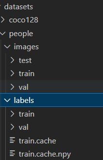

## [HIT] 基于yolov5s的行人检测 --徐涛

[yolov5仓库地址](https://github.com/ultralytics/yolov5)
### 环境配置：

anaconda create --name yolo python=3.7

activate yolo

cd yolov5

pip install -r requirements.txt

有warning不用担心，这是由于配置文件与中文编码冲突的原因。参考：[【WARNING:Ignore distutils configs in setup.cfg due to encoding errors】完美解决](https://blog.csdn.net/a1130061818/article/details/123811002)

pip install labelimg

pip install wandb

需要创建一个wandb账户，可以用github登录，会同步上传训练结果

### 训练模型

使用 /yolov5/models 中的配置文件训练

python train.py --data coco.yaml --cfg yolov5s.yaml --weights '' --batch-size 64

使用coco128训练模型：

python train.py --img 640 --batchsize 16 --epochs 3 --data coco128.yaml --weights yolov5s.pt

使用自己的训练集：

python train.py --img 640 --batchsize 16 --epochs 100 --data people.yaml --weights yolov5s.pt

训练结果在 /yolov5/runs/train/exp 中，每次训练会生成新的exp文件夹，不会覆盖。

如果页面文件空间不足可以系统设置页面文件大小。参考[“OSError: [WinError 1455]页面文件太小，无法完成操作。”解决方案](https://blog.csdn.net/weixin_46133643/article/details/125042903)

或者 在/yolov5/utils/dataloaders.py 中140行将num_workers的参数nw改为0，本项目文件已修改。

如果提示OMP错误，需要在train.py中添加代码。

import os

os.environ["KMP_DUPLICATE_LIB_OK"]="TRUE"

本项目文件已添加。参考：[解决报错 OMP: Error #15: Initializing libiomp5md.dll, but found libiomp5md.dll already initialized](https://blog.csdn.net/weixin_41449637/article/details/108894809)

已经训练过的数据集会生成cache文件，需要删除。

### 目标检测

python detect.py --source ../datasets/people/images/test/test.mp4 --weights best.pt

best.pt 在当前目录/yolov5下

detect结果保存在/yolov5/runs/detect/exp下，同train

### 制作训练集

在datasets中创建一个新的数据集文件夹，包括images和labels，各包含train和val文件夹。

labelimg打开数据标注软件。

打开图像存放文件夹/datasets/people/images/train

打开标记存放文件夹/datasets/people/labels/train

标记文件与图像文件同名。

选择yolo txt格式，xml则需要转成txt格式才能被读取

快捷键

w生成框

a上一张

d下一张

ctrl+s 保存

在data中建立yaml文件，可以用其他文件的副本作为参考格式。
